# Data Collection Methods

### Data by Affiliation 
Datacite metadata were pulled using the `rdatacite` package in November 2022. Each of the six institutions were searched using the name of each University in the `creators.affiliation.name` metadata field. Results were filtered to include DOIs with a `publicationYear` of 2012 or later, and a `resourceTypeGeneral` of dataset or software. As the search terms returned other institutions with similar names, results were filtered to include DOIs only from the relevant institutional affiliations. 

Following recommendations of the Crossref API, metadata was pulled from the April 2022 Public Release file (http://dx.doi.org/10.13003/83b2gq). DOIs were searched records with a `created-dateparts` year of 2012 or newer, that had a `type` of datasets (Crossref does not have software as an available type), and had an author affiliation with one of the six institutions. 

## Instituional repositories
Upon initial examination of the affiliation data, we realized that our own institutional repositories were not represented in the data because the affiliation metadata field was not completed as part of the DOI generation process. 

To pull data shared in our institutional repositories as a comparison, a second search was performed to retrieve DOIs published by the insitutional repositories at each university. For the insitutional repositories using DataCite to issue DOIs (5 out of the 6 institutions at the time), the datacite API queried by names of the institutional repositories in the `publisher` metadata field. For the one institution using CrossRef to issue DOIs (Duke), the crossref API was used to retrieve all DOIs published using the Duke member prefixes.  

Institutional repository data was then filtered to include only the relevant repositories, datasets and software resource types, and DOIs published in 2012 or later. 

Affiliation data from datacite, affiliation data from cross ref, and the institutional repository data were combined into a single dataset. 


# Analysis

Load required packages and read in combined data. 

```r
#packages
pacman::p_load(dplyr, 
               tidyr, 
               ggplot2, 
               rjson,
               rdatacite,
               cowplot, 
               stringr, 
               knitr, 
               DT)


#Load the combined data from 3_Combined_data.R
load(file="data_rdata_files/Combined_ALL_data.Rdata")

#rename object
all_dois <- combined_dois 

#re-factor group so that datacite appears before cross ref
all_dois$group <- factor(all_dois$group, levels = c("Affiliation - Datacite", "Affiliation - CrossRef", "IR_publisher"))
```

# Collapse DOIs by container 

Some repositories (such as Harvard's Dataverse and Qualitative Data Repository) assign DOIs at the level of the file, rather than the study. Similarly, Zenodo often has many related DOIs for multiple figures within a study. In order to attempt to compare study-to-study counts of data sharing, look at the DOIs collapsed by "container".  

```r
by_container <- 
all_dois %>% 
  filter(!is.na(container_identifier)) %>% 
  group_by(container_identifier, publisher, title, institution) %>% 
  summarize(count=n()) %>% 
  arrange(desc(count))
```

How many publishers have container DOIs?

```r
by_container %>% 
  group_by(publisher) %>% 
  summarize(count=n()) %>% 
  arrange(desc(count)) %>% 
  datatable
```

```{=html}
<div id="htmlwidget-a404e0c6cfb465bc1b35" style="width:100%;height:auto;" class="datatables html-widget"></div>
<script type="application/json" data-for="htmlwidget-a404e0c6cfb465bc1b35">{"x":{"filter":"none","vertical":false,"data":[["1","2","3","4","5","6","7","8","9","10","11","12","13","14","15","16","17","18","19","20","21"],["Harvard Dataverse","Zenodo","QDR Main Collection","Root","DataverseNO","Johns Hopkins University Data Archive","Portail Data INRAE","Recherche Data Gouv","ACSS Dataverse","Dartmouth Dataverse","Earth System Grid Federation","Qualitative Data Repository","TRR 170-DB","ASU Library Research Data Repository","CaltechDATA","DaRUS","Dryad","G-Node","International Potato Center","Social Sciences and Digital Humanities Archive – SODHA","World Values Survey Association"],[358,110,6,5,3,3,3,3,2,2,2,2,2,1,1,1,1,1,1,1,1]],"container":"<table class=\"display\">\n  <thead>\n    <tr>\n      <th> <\/th>\n      <th>publisher<\/th>\n      <th>count<\/th>\n    <\/tr>\n  <\/thead>\n<\/table>","options":{"columnDefs":[{"className":"dt-right","targets":2},{"orderable":false,"targets":0}],"order":[],"autoWidth":false,"orderClasses":false}},"evals":[],"jsHooks":[]}</script>
```


Collapsing by container for counts

```r
containerdups <- which(!is.na(all_dois$container_identifier) & duplicated(all_dois$container_identifier))

all_dois_collapsed <- all_dois[-containerdups,]
```

This leaves a total of 165950 cases. 


# Overview of the data

DOI types by resource

```r
all_dois_collapsed %>% 
  group_by(resourceTypeGeneral, group) %>% 
  summarize(count=n()) %>% 
  pivot_wider(names_from = group, 
              values_from = count, 
              values_fill = 0) %>% 
  kable()
```


|resourceTypeGeneral | Affiliation - Datacite| Affiliation - CrossRef| IR_publisher|
|:-------------------|----------------------:|----------------------:|------------:|
|Dataset             |                  11572|                 147702|         2103|
|Software            |                   4512|                      0|           61|


DOI by institutional affiliation/publisher

```r
all_dois_collapsed %>% 
  group_by(group, institution) %>% 
  summarize(count=n()) %>% 
  pivot_wider(names_from = group,
              values_from = count) %>% 
  kable()
```


|institution   | Affiliation - Datacite| Affiliation - CrossRef| IR_publisher|
|:-------------|----------------------:|----------------------:|------------:|
|Cornell       |                   3921|                    706|          174|
|Duke          |                   2372|                   3603|          225|
|Michigan      |                   4188|                 141111|          645|
|Minnesota     |                   2408|                   1700|          692|
|Virginia Tech |                   1553|                     64|          333|
|Washington U  |                   1642|                    518|           95|


## Collapse IRs into a single category

Look at all the Institutional Repositories Captured

```r
IR_pubs <- all_dois_collapsed %>% 
  filter(group == "IR_publisher") %>% 
  group_by(publisher_plus) %>% 
  summarize(count = n()) 

IR_pubs %>% 
  kable(col.names = c("Institutional Repository", "Count"))
```


|Institutional Repository                       | Count|
|:----------------------------------------------|-----:|
|Cornell                                        |   174|
|Duke-Duke Digital Repository                   |    78|
|Duke-Research Data Repository, Duke University |   147|
|Michigan                                       |    10|
|Michigan-Deep Blue                             |   515|
|Michigan-ICPSR/ISR                             |   109|
|Michigan-Other                                 |    11|
|Minnesota                                      |   692|
|Virginia Tech                                  |   333|
|Washington U                                   |    95|

Replace all of these publishers with "Institutional Repository" so that they will be represented in a single bar.

```r
all_dois_collapsed$publisher[which(all_dois_collapsed$publisher_plus %in% unique(IR_pubs$publisher_plus))] <- "Institutional Repository"

#catch the rest of the "Cornell University Library"
all_dois_collapsed$publisher[which(all_dois_collapsed$publisher == "Cornell University Library")] <- "Institutional Repository"

#and stray VT
all_dois_collapsed$publisher[which(all_dois_collapsed$publisher == "University Libraries, Virginia Tech")] <- "Institutional Repository"

#and DRUM
all_dois_collapsed$publisher[which(all_dois_collapsed$publisher == "Data Repository for the University of Minnesota (DRUM)")] <- "Institutional Repository"

##ICPSR is also inconsistent
all_dois_collapsed$publisher[grep("Consortium for Political", all_dois_collapsed$publisher)] <- "ICPSR"
```


## Overall Count of Data and Software DOIs

Think we just keep these together for the main analysis...


```r
by_publisher_collapse <- all_dois_collapsed %>% 
  group_by(publisher, institution) %>% 
  summarize(count=n()) %>% 
  arrange(institution, desc(count))
```

Table of publisher counts

```r
by_publisher_collapse_table <- by_publisher_collapse %>% 
  pivot_wider(names_from = institution, 
              values_from = count, 
              values_fill = 0) %>% 
  rowwise %>% 
  mutate(Total = sum(c_across(Cornell:`Washington U`))) %>% 
  arrange(desc(Total))

by_publisher_collapse_table %>% 
  datatable
```

```{=html}
<div id="htmlwidget-e0d994a0041ffe49ec2d" style="width:100%;height:auto;" class="datatables html-widget"></div>
<script type="application/json" data-for="htmlwidget-e0d994a0041ffe49ec2d">{"x":{"filter":"none","vertical":false,"data":[["1","2","3","4","5","6","7","8","9","10","11","12","13","14","15","16","17","18","19","20","21","22","23","24","25","26","27","28","29","30","31","32","33","34","35","36","37","38","39","40","41","42","43","44","45","46","47","48","49","50","51","52","53","54","55","56","57","58","59","60","61","62","63","64","65","66","67","68","69","70","71","72","73","74","75","76","77","78","79","80","81","82","83","84","85","86","87","88","89","90","91","92","93","94","95","96","97","98","99","100","101","102","103","104","105","106","107","108","109","110","111","112","113","114","115","116","117","118","119","120","121","122","123","124","125","126","127","128","129","130","131","132","133","134","135","136","137","138","139","140","141","142","143","144","145","146","147","148","149","150","151","152","153","154","155","156","157","158","159","160","161","162","163","164","165","166","167","168","169","170","171","172","173","174","175","176"],["ENCODE Data Coordination Center","Faculty Opinions Ltd","Zenodo","Dryad","Institutional Repository","figshare","ICPSR","Harvard Dataverse","Taylor &amp; Francis","Neotoma Paleoecological Database","VTTI","MassIVE","SciELO journals","Authorea, Inc.","Code Ocean","Borealis","OBIS-SEAMAP","Future Science Group","SAGE Journals","KNB Data Repository","IEEE DataPort","Biological and Chemical Oceanography Data Management Office","Optica Publishing Group","NASA Space Physics Data Facility","Databrary","Virginia Tech Transportation Institute","UCAR/NCAR - Earth Observing Laboratory","Biological and Chemical Oceanography Data Management Office (BCO-DMO)","The Royal Society","CSIRO","DOE Joint Genome Institute","UNC Dataverse","NSF Arctic Data Center","ImmPort","Washington University in St. Louis","DataverseNL","CyVerse Data Commons","Geochemistry, Geophysics, Geosystems","QDR Main Collection","G-Node","Cornell Institute for Social and Economic Research","Root","SBGrid Data Bank","NOAA Global Monitoring Laboratory","AmeriFlux; University of Minnesota; USDA-ARS","International Federation of Digital Seismograph Networks","Stanford Digital Repository","Arctic Data Center","CaltechDATA","USDA Forest Service","Environmental System Science Data Infrastructure for a Virtual Ecosystem; Defense Coastal/Estuarine Research Program (DCERP)","World Values Survey Association","Data Repository for the University of Minnesota","PARADIM, an NSF Materials Innovation Platform","Johns Hopkins University Data Archive","GSA Journals","DataverseNO","Portail Data INRAE","Recherche Data Gouv","Cornell University Museum of Vertebrates","DR-NTU (Data)","University of St Andrews","Science Data Bank","CSES - Comparative Study of Electoral Systems","Cornell Center for Social Sciences","Earth System Grid Federation","TRR 170-DB","NERC Environmental Information Data Centre","Environmental System Science Data Infrastructure for a Virtual Ecosystem; Free Air CO2 Enrichment Model Data Synthesis (FACE-MDS)","SCAR - Microbial Antarctic Resource System","EnviDat","Open Data Commons for Spinal Cord Injury (ODC-SCI)","DANS/KNAW","Dartmouth Dataverse","ACSS Dataverse","GESIS Data Archive","Journal of Geophysical Research: Solid Earth","Qualitative Data Repository","Digital Rocks Portal","GFZ Data Services","Environmental System Science Data Infrastructure for a Virtual Ecosystem; Trace Metal Dynamics and Limitations on Biogeochemical Cycling in Wetland Soils and Hyporheic Zones","A Rocha Kenya","Edmond","AmeriFlux; University of Toledo / Michigan State University","Data Archiving and Networked Services (DANS)","FluxNet; University of Toledo / Michigan State University","Root Dataverse","Social Sciences and Digital Humanities Archive – SODHA","Penn State Data Commons","National Renewable Energy Laboratory - Data (NREL-DATA), Golden, CO (United States); National Renewable Energy Laboratory (NREL), Golden, CO (United States)","ASU Library Research Data Repository","PLOS One","SimTK","ADA Dataverse","The University of Western Australia","University of Western Australia","CoMSES Net","DataFirst","NOAA Earth System Research Laboratory, Global Monitoring Division","UCAR/NCAR - EarthCube","DaRUS","Environmental System Science Data Infrastructure for a Virtual Ecosystem; AmeriFlux Management Project","University of Minnesota","International Potato Center","Microbiology Society","American College of Radiology","American Journal of Agricultural Economics","DataSuds","Journal of Human Resources","Mohonk Preserve","MultiSector Dynamics - Living, Intuitive, Value-adding, Environment","National Institute of Standards and Technology","NOAA National Centers for Environmental Information","Universität Konstanz","University of Massachusetts Amherst","Center for International Forestry Research (CIFOR)","Environmental System Science Data Infrastructure for a Virtual Ecosystem; Net Methylation Potential of Mercury Sulfides for Different Groups of the Methylating Microbial Community","Jülich DATA","National Data Archive on Child Abuse and Neglect (NDACAN)","NILU - Norsk Institutt for Luftforskning","Oxford Brookes University","Pfizer","SEANOE","Southwestern Pacific Ocean Biogeographic Information System (OBIS) Node","U.S. Geological Survey","UiT Open Research Data Dataverse","World Data Center for Climate (WDCC) at DKRZ","Center for Macroecology, Evolution and Climate, University of Copenhagen","EarthSpace","Institute for Research on Innovation and Science (IRIS)","International Soil Carbon Network (ISCN);","Invasive Species Specialist Group ISSG","Los Alamos National Laboratory (LANL), Los Alamos, NM (United States)","NASA Planetary Data System","National Data Archive on Child Abuse and Neglect","Natural History Museum","physionet.org","Publisher","Sandia National Laboratories (SNL-NM), Albuquerque, NM (United States)","UCLA Dataverse","UNAVCO, Inc","University of Bath","University of Leeds","University of Miami Libraries","University of Michigan Museum of Paleontology","Utah State University","Κατάλογος Δεδομένων SoDaNet","AmeriFlux; University of Minnesota; USDA- Forest Service","AmeriFlux; University of Minnesota; USDA-Forest Service","AmeriFlux; University of Minnesota; USDA-Forest Service-International Programs","Environmental System Science Data Infrastructure for a Virtual Ecosystem; AmeriFlux","Environmental System Science Data Infrastructure for a Virtual Ecosystem; AmeriFlux Network Management Project","EOL Data Support. UCAR/NCAR - Earth Observing Laboratory","Forest Service Research Data Archive","Geology","Global Carbon Project","Lawrence Berkeley National Laboratory (LBNL), Berkeley, CA (United States)","LibGuides dataset: Subject guides at academic libraries","Max Planck Institute for Biogeochemistry, Jena","Proceedings of the National Academy of Sciences","Tectonics","University of Iowa","University of Oxford","University of Utah","Digital Rocks Portal University of Texas at Austin","Environmental System Science Data Infrastructure for a Virtual Ecosystem","Northwest Knowledge Network","Univeristy of Leeds","Virginia Polytechnic Inst. and State Univ. (Virginia Tech), Blacksburg, VA (United States)","Digital Commons @ Becker, Data and Supporting Files","Digital Commons@Becker, Data and Supporting files","Digital Commons@Becker, Data and Supporting Files","Environmental System Science Data Infrastructure for a Virtual Ecosystem; Trace Metal Dynamics and Limitations on Biogeochemical Cycling in Wetland Soils and Hyporheic Zones, PI Jeffrey G. Catalano","ForestPlots.net","Open Data Repository","Woods Hole Oceanographic Institution"],[12,674,1944,656,208,597,92,251,105,0,0,30,22,12,11,11,0,4,2,19,1,6,0,0,15,0,4,5,10,4,4,1,0,0,0,4,12,1,4,0,11,0,8,0,0,7,0,0,4,2,0,0,0,6,0,0,0,0,0,5,5,3,1,0,4,4,4,1,0,0,0,0,0,0,0,0,0,0,0,0,0,2,1,0,0,0,0,0,0,0,0,2,1,0,0,0,0,0,0,0,0,0,0,0,0,0,1,1,1,1,1,1,1,1,1,0,0,0,0,0,0,0,0,0,0,0,0,0,0,0,0,0,0,0,0,0,0,0,0,0,0,0,0,0,0,0,0,0,0,0,0,0,0,0,0,0,0,0,0,0,0,0,0,0,0,0,0,0,0,0,0,0,0,0,0,0],[1006,2574,975,469,226,238,125,289,30,4,0,34,12,10,17,15,49,2,2,10,0,13,4,0,13,0,0,2,0,1,6,9,15,9,0,2,0,0,6,4,0,0,0,0,0,0,0,0,0,0,4,0,0,0,4,2,0,0,0,0,0,0,0,0,0,0,0,0,2,2,1,1,0,0,0,0,0,0,0,0,0,0,0,0,0,0,0,0,0,0,0,0,1,0,0,0,0,0,0,0,0,0,0,0,0,0,0,0,0,0,0,0,0,0,0,1,1,1,1,1,1,1,1,1,1,1,1,0,0,0,0,0,0,0,0,0,0,0,0,0,0,0,0,0,0,0,0,0,0,0,0,0,0,0,0,0,0,0,0,0,0,0,0,0,0,0,0,0,0,0,0,0,0,0,0,0],[138566,2516,1471,496,646,373,1178,308,75,0,1,12,12,16,20,9,0,0,12,2,15,10,15,0,0,0,21,7,6,0,4,4,0,3,0,3,0,0,2,2,0,11,1,7,0,1,9,7,4,2,1,8,0,0,2,0,6,6,0,0,0,0,1,3,0,0,0,0,2,1,0,0,4,4,2,2,2,2,1,1,0,1,2,3,3,3,3,3,1,0,0,0,0,2,2,2,1,1,1,1,0,0,0,0,0,0,0,0,0,0,0,0,0,0,0,0,0,0,0,0,0,0,0,0,0,0,0,1,1,1,1,1,1,1,1,1,1,1,1,1,1,1,1,1,1,1,1,0,0,0,0,0,0,0,0,0,0,0,0,0,0,0,0,0,0,0,0,0,0,0,0,0,0,0,0,0],[0,1682,842,528,769,231,99,123,52,210,2,11,6,13,16,20,0,4,2,2,10,0,0,29,0,0,0,10,0,14,3,2,1,3,0,6,2,12,0,6,0,0,0,3,10,0,0,2,0,4,0,0,7,0,0,2,0,0,6,0,0,1,3,2,0,0,0,3,0,0,3,3,0,0,2,2,2,2,0,3,0,0,0,0,0,0,0,0,2,3,0,0,0,0,0,0,1,0,1,0,2,2,2,0,0,0,0,0,0,0,0,0,0,0,0,0,0,0,0,0,0,0,0,0,0,0,0,0,0,0,0,0,0,0,0,0,0,0,0,0,0,0,0,0,0,0,0,1,1,1,1,1,1,1,1,1,1,1,1,1,1,1,1,1,0,0,0,0,0,0,0,0,0,0,0,0],[0,64,706,158,446,296,6,28,43,0,113,1,10,0,0,5,0,22,0,1,1,0,0,0,0,27,0,0,0,0,0,1,0,0,0,0,0,0,0,0,0,0,0,0,0,1,0,0,0,0,3,0,0,0,0,2,0,0,0,0,0,0,0,0,0,0,0,0,0,0,0,0,0,0,0,0,0,0,3,0,0,0,0,0,0,0,0,0,0,0,3,0,0,0,0,0,0,0,0,1,0,0,0,2,2,0,0,0,0,0,0,0,0,0,0,0,0,0,0,0,0,0,0,0,0,0,0,0,0,0,0,0,0,0,0,0,0,0,0,0,0,0,0,0,0,0,0,0,0,0,0,0,0,0,0,0,0,0,0,0,0,0,0,0,1,1,1,1,1,0,0,0,0,0,0,0],[0,502,640,149,95,545,49,0,155,0,0,12,12,14,0,0,0,12,18,0,4,0,10,0,0,0,0,0,4,0,0,0,0,1,16,0,0,0,0,0,0,0,1,0,0,0,0,0,0,0,0,0,0,0,0,0,0,0,0,0,0,1,0,0,0,0,0,0,0,1,0,0,0,0,0,0,0,0,0,0,4,0,0,0,0,0,0,0,0,0,0,0,0,0,0,0,0,1,0,0,0,0,0,0,0,2,0,0,0,0,0,0,0,0,0,0,0,0,0,0,0,0,0,0,0,0,0,0,0,0,0,0,0,0,0,0,0,0,0,0,0,0,0,0,0,0,0,0,0,0,0,0,0,0,0,0,0,0,0,0,0,0,0,0,0,0,0,0,0,1,1,1,1,1,1,1],[139584,8012,6578,2456,2390,2280,1549,999,460,214,116,100,74,65,64,60,49,44,36,34,31,29,29,29,28,27,25,24,20,19,17,17,16,16,16,15,14,13,12,12,11,11,10,10,10,9,9,9,8,8,8,8,7,6,6,6,6,6,6,5,5,5,5,5,4,4,4,4,4,4,4,4,4,4,4,4,4,4,4,4,4,3,3,3,3,3,3,3,3,3,3,2,2,2,2,2,2,2,2,2,2,2,2,2,2,2,1,1,1,1,1,1,1,1,1,1,1,1,1,1,1,1,1,1,1,1,1,1,1,1,1,1,1,1,1,1,1,1,1,1,1,1,1,1,1,1,1,1,1,1,1,1,1,1,1,1,1,1,1,1,1,1,1,1,1,1,1,1,1,1,1,1,1,1,1,1]],"container":"<table class=\"display\">\n  <thead>\n    <tr>\n      <th> <\/th>\n      <th>publisher<\/th>\n      <th>Cornell<\/th>\n      <th>Duke<\/th>\n      <th>Michigan<\/th>\n      <th>Minnesota<\/th>\n      <th>Virginia Tech<\/th>\n      <th>Washington U<\/th>\n      <th>Total<\/th>\n    <\/tr>\n  <\/thead>\n<\/table>","options":{"columnDefs":[{"className":"dt-right","targets":[2,3,4,5,6,7,8]},{"orderable":false,"targets":0}],"order":[],"autoWidth":false,"orderClasses":false}},"evals":[],"jsHooks":[]}</script>
```


Write out the table of data & software publishers

```r
write.csv(by_publisher_collapse_table, file="data_summary_data/Counts of  Publishers By Insitituion - Collapsed by container.csv", row.names = F)
```


## Graphs


### Top 8 publishers of data dois


```r
by_publisher_dc_collapse <- all_dois_collapsed %>% 
  group_by(publisher, institution) %>% 
  summarize(count=n()) %>% 
  arrange(institution, desc(count))

#table of  publishers - data
by_publisher_dc_collapse_table <- by_publisher_dc_collapse %>% 
  pivot_wider(names_from = institution, 
              values_from = count, 
              values_fill = 0) %>% 
  rowwise %>% 
  mutate(Total = sum(c_across(Cornell:`Washington U`))) %>% 
  arrange(desc(Total))
```

Look at publishers based on rank of number of DOIs

```r
by_publisher_dc_collapse_table %>% 
  group_by(publisher) %>% 
  summarize(count=sum(Total)) %>% 
  arrange(desc(count)) %>% 
  mutate(pubrank = order(count, decreasing = T)) %>% 
  ggplot(aes(x=pubrank, y=count)) +
  geom_bar(stat="identity") +
  scale_x_continuous(limits = c(0,25)) +
  labs(x = "Publisher Rank", y="Number of DOIs", title="Number of DOIs by top Publishers")+
  theme_bw() 
```

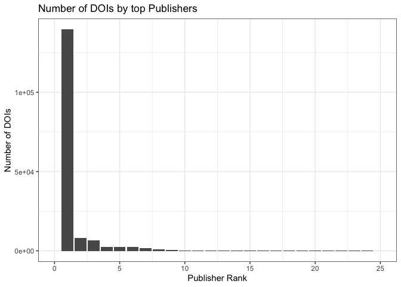<!-- -->

Look at the top 8 publishers - how many does this capture?

```r
top8pubs <- by_publisher_dc_collapse_table$publisher[1:8]

by_publisher_dc_collapse_table %>% 
  group_by(publisher) %>% 
  summarize(count=sum(Total)) %>% 
  mutate(intop8pub = publisher %in% top8pubs) %>% 
  group_by(intop8pub) %>% 
  summarize(totalDOIs = sum(count), nrepos = n()) %>% 
  ungroup() %>% 
  mutate(propDOIs = totalDOIs/sum(totalDOIs))
```

```
## # A tibble: 2 × 4
##   intop8pub totalDOIs nrepos propDOIs
##   <lgl>         <int>  <int>    <dbl>
## 1 FALSE          2102    168   0.0127
## 2 TRUE         163848      8   0.987
```


```r
top8colors <- c("Harvard Dataverse" = "dodgerblue2",
                "Zenodo" = "darkorange1",
                "ICPSR" = "darkcyan",
                "Dryad" = "lightgray", 
                "figshare" = "purple", 
                "Institutional Repository" = "lightblue", 
                "ENCODE Data Coordination Center" = "gold2", 
                "Faculty Opinions Ltd" = "darkgreen")


(by_publisher_plot_collapse <-  by_publisher_dc_collapse %>% 
    filter(publisher %in% top8pubs) %>% 
    ggplot(aes(x=institution, y=count, fill=publisher)) +
    geom_bar(stat="identity", position=position_dodge(preserve = "single")) +
    scale_fill_manual(values = top8colors, name="Publisher")+
    guides(fill = guide_legend(title.position = "top")) +
    scale_y_continuous(breaks = seq(from = 0, to=5000, by=500)) +
    coord_cartesian(ylim = c(0,5000)) +
    labs(x = "Institution", y="Count of Collapsed DOIs", caption = "Note: Michigan ENCODE bar cut off for scaling") +
    theme_bw() +
    theme(legend.position = "bottom", legend.title.align = .5))
```

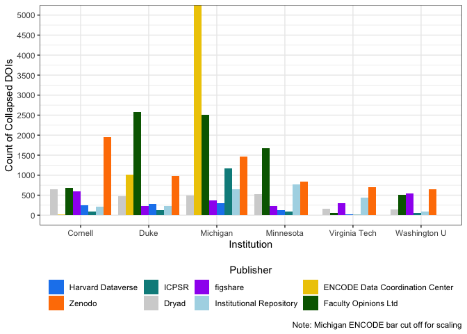<!-- -->

```r
ggsave(by_publisher_plot_collapse, filename = "figures/Counts of DOIs by Institution_DOIcollapsed.png", device = "png",  width = 8, height = 6, units="in")
```


### Institutional Graphs - Collapsed {.tabset .tabset-fade .tabset-pills}

#### Cornell

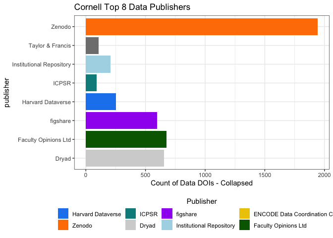<!-- -->

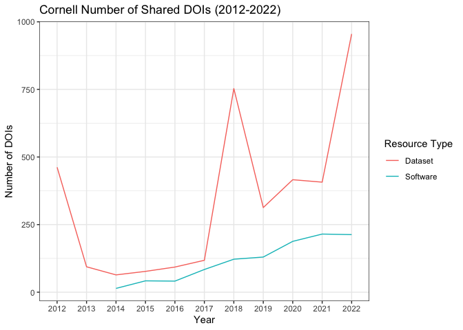<!-- -->

#### Duke

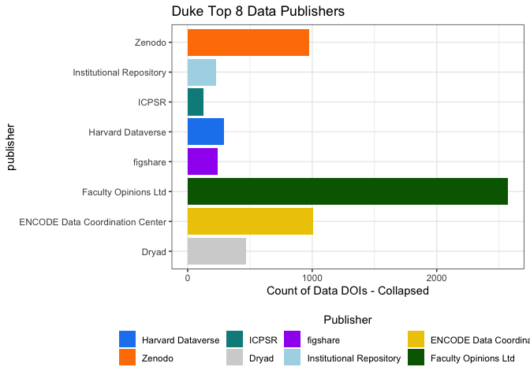<!-- -->

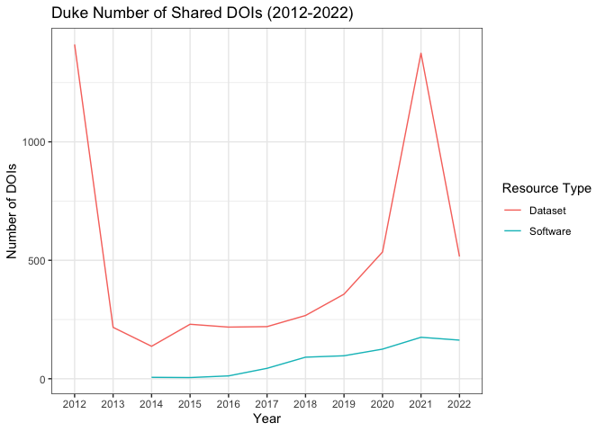<!-- -->

#### Michigan

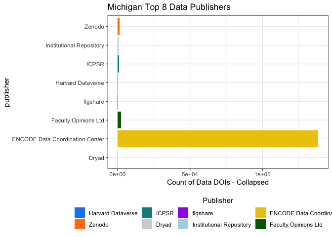<!-- -->

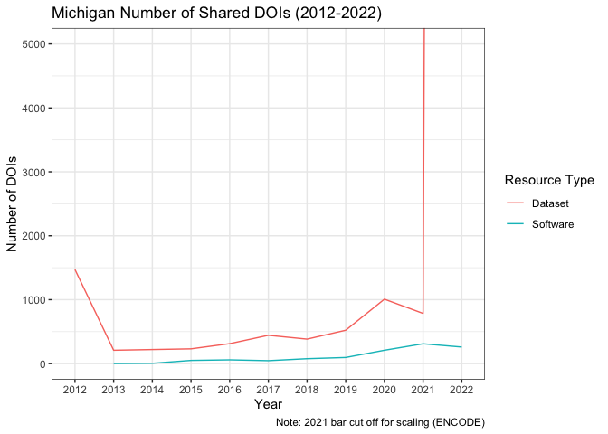<!-- -->

#### Minnesota

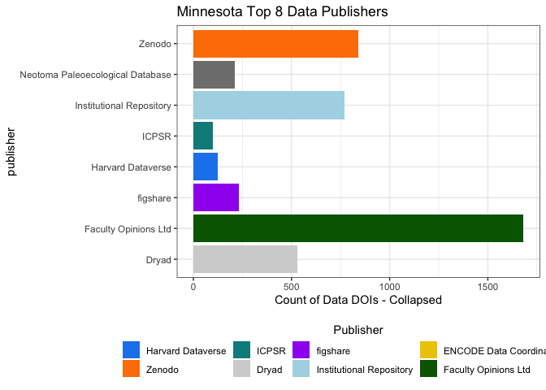<!-- -->

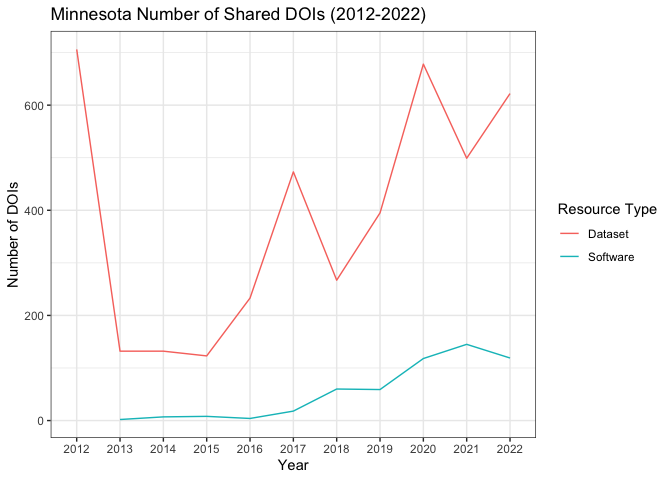<!-- -->

#### Virginia Tech

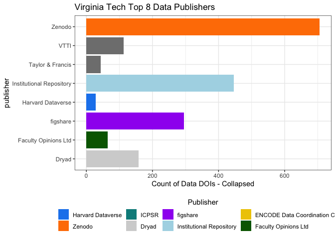<!-- -->

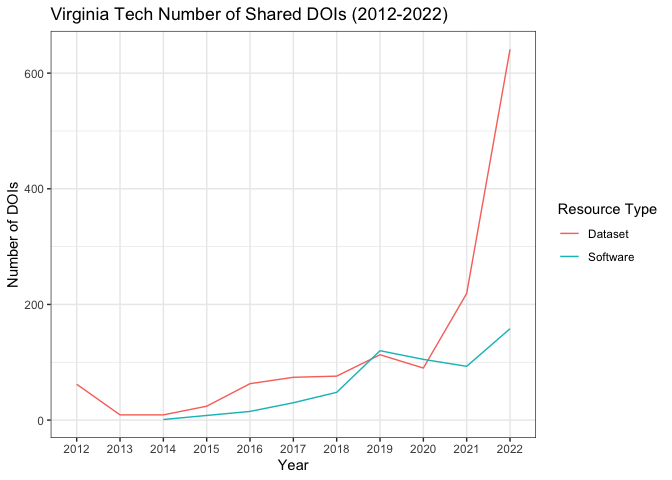<!-- -->

#### Wash U

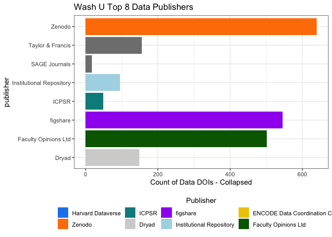<!-- -->

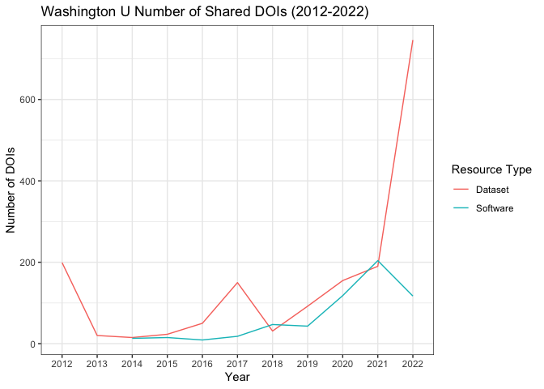<!-- -->

# Repository Poliferation by Year

How many different publishers are researchers sharing their data and how does this change over time?


```r
by_year_nrepos <- all_dois_collapsed %>% 
  group_by(publicationYear, publisher, institution) %>% 
  summarize(nDOIs = n()) %>% 
  group_by(publicationYear, institution) %>% 
  summarize(npublishers = n(), totalDOIs = sum(nDOIs))

by_year_nrepos %>% 
  ggplot(aes(x=publicationYear, y=npublishers, group=institution)) +
  geom_line(aes(color=institution)) +
  labs(x="Year", 
       y="Number of Repositories", 
       title="Number of Repositories Where Data and Software are Shared Across Time") +
  theme_bw() +
  theme(legend.title = element_blank())
```

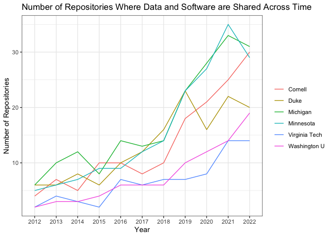<!-- -->


# Further collapse by Version

We can also look at the data collapsed by version of a record. This was motivated because some repositories have multiple entries for the different versions of the same dataset/collection. And some entries have many versions. 

Explore versions

Some Repositories attach "vX" to the doi. 

```r
all_dois_collapsed <- all_dois_collapsed %>% 
  mutate(hasversion = grepl("\\.v[[:digit:]]+$", DOI))


all_dois_collapsed %>% 
  filter(hasversion == TRUE) %>% 
  group_by(publisher, hasversion) %>% 
  summarize(count=n()) %>% 
  arrange(desc(count)) %>% 
  datatable()
```

```{=html}
<div id="htmlwidget-47781f8a9e3dcf1fe35d" style="width:100%;height:auto;" class="datatables html-widget"></div>
<script type="application/json" data-for="htmlwidget-47781f8a9e3dcf1fe35d">{"x":{"filter":"none","vertical":false,"data":[["1","2","3","4","5","6","7","8","9","10","11","12","13","14"],["figshare","Taylor &amp; Francis","ICPSR","Institutional Repository","Code Ocean","SciELO journals","Future Science Group","SAGE Journals","Optica Publishing Group","The Royal Society","GSA Journals","Dryad","Microbiology Society","Pfizer"],[true,true,true,true,true,true,true,true,true,true,true,true,true,true],[1183,242,230,62,44,37,22,18,14,10,3,2,1,1]],"container":"<table class=\"display\">\n  <thead>\n    <tr>\n      <th> <\/th>\n      <th>publisher<\/th>\n      <th>hasversion<\/th>\n      <th>count<\/th>\n    <\/tr>\n  <\/thead>\n<\/table>","options":{"columnDefs":[{"className":"dt-right","targets":3},{"orderable":false,"targets":0}],"order":[],"autoWidth":false,"orderClasses":false}},"evals":[],"jsHooks":[]}</script>
```

Some repositories use the "VersionCount" 

```r
all_dois_collapsed %>% 
  filter(versionCount > 0) %>% 
  group_by(publisher) %>% 
  summarize(count=n(), AvgNversions = round(mean(versionCount),2)) %>% 
  arrange(desc(count)) %>% 
  datatable()
```

```{=html}
<div id="htmlwidget-4f3e9f7e41f311d669ab" style="width:100%;height:auto;" class="datatables html-widget"></div>
<script type="application/json" data-for="htmlwidget-4f3e9f7e41f311d669ab">{"x":{"filter":"none","vertical":false,"data":[["1","2"],["Zenodo","ICPSR"],[765,116],[4.65,2.14]],"container":"<table class=\"display\">\n  <thead>\n    <tr>\n      <th> <\/th>\n      <th>publisher<\/th>\n      <th>count<\/th>\n      <th>AvgNversions<\/th>\n    <\/tr>\n  <\/thead>\n<\/table>","options":{"columnDefs":[{"className":"dt-right","targets":[2,3]},{"orderable":false,"targets":0}],"order":[],"autoWidth":false,"orderClasses":false}},"evals":[],"jsHooks":[]}</script>
```

Some use "metadataVersion"

```r
all_dois_collapsed %>% 
  filter(metadataVersion > 0) %>% 
  group_by(publisher) %>% 
  summarize(count=n(), AvgNversions = round(mean(metadataVersion),2)) %>% 
  arrange(desc(count)) %>% 
  datatable()
```

```{=html}
<div id="htmlwidget-8b0e88cd027cad132e62" style="width:100%;height:auto;" class="datatables html-widget"></div>
<script type="application/json" data-for="htmlwidget-8b0e88cd027cad132e62">{"x":{"filter":"none","vertical":false,"data":[["1","2","3","4","5","6","7","8","9","10","11","12","13","14","15","16","17","18","19","20","21","22","23","24","25","26","27","28","29","30","31","32","33","34","35","36","37","38","39","40","41","42","43","44","45","46","47","48","49","50","51","52","53","54","55","56","57","58","59","60","61","62","63","64","65","66","67","68","69","70","71","72","73","74","75","76","77","78","79","80","81","82","83","84","85","86","87","88","89","90","91","92","93","94","95","96","97","98","99","100","101","102","103","104","105","106","107","108","109","110","111","112","113","114","115","116","117","118","119","120","121","122","123","124","125","126","127","128","129"],["Zenodo","Dryad","Institutional Repository","figshare","ICPSR","Taylor &amp; Francis","Harvard Dataverse","VTTI","Borealis","SciELO journals","OBIS-SEAMAP","KNB Data Repository","SAGE Journals","Code Ocean","Optica Publishing Group","Virginia Tech Transportation Institute","Future Science Group","Databrary","CSIRO","ImmPort","Washington University in St. Louis","The Royal Society","UCAR/NCAR - Earth Observing Laboratory","NOAA Global Monitoring Laboratory","QDR Main Collection","Geochemistry, Geophysics, Geosystems","Stanford Digital Repository","UNC Dataverse","CaltechDATA","Environmental System Science Data Infrastructure for a Virtual Ecosystem; Defense Coastal/Estuarine Research Program (DCERP)","International Federation of Digital Seismograph Networks","SBGrid Data Bank","Cornell Institute for Social and Economic Research","AmeriFlux; University of Minnesota; USDA-ARS","Data Repository for the University of Minnesota","PARADIM, an NSF Materials Innovation Platform","Recherche Data Gouv","Cornell University Museum of Vertebrates","CSES - Comparative Study of Electoral Systems","Root","Cornell Center for Social Sciences","Dartmouth Dataverse","Digital Rocks Portal","Earth System Grid Federation","Environmental System Science Data Infrastructure for a Virtual Ecosystem; Free Air CO2 Enrichment Model Data Synthesis (FACE-MDS)","Environmental System Science Data Infrastructure for a Virtual Ecosystem; Trace Metal Dynamics and Limitations on Biogeochemical Cycling in Wetland Soils and Hyporheic Zones","GESIS Data Archive","NERC Environmental Information Data Centre","Qualitative Data Repository","SCAR - Microbial Antarctic Resource System","University of St Andrews","World Values Survey Association","A Rocha Kenya","AmeriFlux; University of Toledo / Michigan State University","Arctic Data Center","Data Archiving and Networked Services (DANS)","FluxNet; University of Toledo / Michigan State University","National Renewable Energy Laboratory - Data (NREL-DATA), Golden, CO (United States); National Renewable Energy Laboratory (NREL), Golden, CO (United States)","ADA Dataverse","ASU Library Research Data Repository","DataverseNL","DR-NTU (Data)","EnviDat","Environmental System Science Data Infrastructure for a Virtual Ecosystem; AmeriFlux Management Project","G-Node","GSA Journals","Journal of Geophysical Research: Solid Earth","NOAA Earth System Research Laboratory, Global Monitoring Division","Open Data Commons for Spinal Cord Injury (ODC-SCI)","SimTK","Social Sciences and Digital Humanities Archive – SODHA","TRR 170-DB","UCAR/NCAR - EarthCube","ACSS Dataverse","AmeriFlux; University of Minnesota; USDA- Forest Service","AmeriFlux; University of Minnesota; USDA-Forest Service-International Programs","Center for International Forestry Research (CIFOR)","Center for Macroecology, Evolution and Climate, University of Copenhagen","CyVerse Data Commons","DaRUS","DataFirst","DataverseNO","Digital Commons @ Becker, Data and Supporting Files","Digital Commons@Becker, Data and Supporting files","Digital Commons@Becker, Data and Supporting Files","Digital Rocks Portal University of Texas at Austin","Edmond","Environmental System Science Data Infrastructure for a Virtual Ecosystem","Environmental System Science Data Infrastructure for a Virtual Ecosystem; AmeriFlux","Environmental System Science Data Infrastructure for a Virtual Ecosystem; AmeriFlux Network Management Project","Environmental System Science Data Infrastructure for a Virtual Ecosystem; Net Methylation Potential of Mercury Sulfides for Different Groups of the Methylating Microbial Community","Environmental System Science Data Infrastructure for a Virtual Ecosystem; Trace Metal Dynamics and Limitations on Biogeochemical Cycling in Wetland Soils and Hyporheic Zones, PI Jeffrey G. Catalano","ForestPlots.net","Geology","Global Carbon Project","Institute for Research on Innovation and Science (IRIS)","International Potato Center","International Soil Carbon Network (ISCN);","Invasive Species Specialist Group ISSG","Johns Hopkins University Data Archive","Jülich DATA","Lawrence Berkeley National Laboratory (LBNL), Berkeley, CA (United States)","LibGuides dataset: Subject guides at academic libraries","Max Planck Institute for Biogeochemistry, Jena","Microbiology Society","Mohonk Preserve","NASA Planetary Data System","NASA Space Physics Data Facility","National Data Archive on Child Abuse and Neglect","National Data Archive on Child Abuse and Neglect (NDACAN)","National Institute of Standards and Technology","Natural History Museum","NOAA National Centers for Environmental Information","Open Data Repository","Pfizer","PLOS One","Publisher","SEANOE","Southwestern Pacific Ocean Biogeographic Information System (OBIS) Node","Tectonics","U.S. Geological Survey","UiT Open Research Data Dataverse","Univeristy of Leeds","Universität Konstanz","University of Iowa","University of Michigan Museum of Paleontology","University of Minnesota","University of Utah","University of Western Australia"],[2500,2374,1929,1460,1075,430,365,113,60,56,49,31,28,27,27,27,24,23,16,15,13,12,12,10,10,9,9,9,8,8,8,8,7,6,6,6,6,5,5,5,4,4,4,4,4,4,4,4,4,4,4,4,3,3,3,3,3,3,2,2,2,2,2,2,2,2,2,2,2,2,2,2,2,1,1,1,1,1,1,1,1,1,1,1,1,1,1,1,1,1,1,1,1,1,1,1,1,1,1,1,1,1,1,1,1,1,1,1,1,1,1,1,1,1,1,1,1,1,1,1,1,1,1,1,1,1,1,1,1],[2.81,14.11,2.15,2,3.27,8.75,1.72,4.86,2.08,1.18,1,5.68,1,1.96,1.63,7.07,1,52.39,1.56,2.93,1.77,1.75,9.25,3,1.6,4.33,3,1.11,4.62,2.12,1.38,2.12,1.43,6.83,1.17,2.33,3,65,7,1.4,1.75,1.5,1.75,8,5,2.25,15.5,14.75,2.75,4.25,1.5,4.5,4.67,14.67,1,3.33,5,1,1,4.5,1.5,4,1.5,2,2,1,5,4,1,3,3.5,3,10,1,2,3,6,8,1,1,3,2,3,1,1,3,1,1,3,1,1,1,4,1,13,1,3,4,12,2,3,2,1,1,1,3,2,1,2,3,3,1,4,4,3,1,1,7,10,1,2,2,1,1,13,7,2,1,1]],"container":"<table class=\"display\">\n  <thead>\n    <tr>\n      <th> <\/th>\n      <th>publisher<\/th>\n      <th>count<\/th>\n      <th>AvgNversions<\/th>\n    <\/tr>\n  <\/thead>\n<\/table>","options":{"columnDefs":[{"className":"dt-right","targets":[2,3]},{"orderable":false,"targets":0}],"order":[],"autoWidth":false,"orderClasses":false}},"evals":[],"jsHooks":[]}</script>
```


How to collapse by version? Maybe that's for another day... 


# Completeness? 


# Write out institutional data

Write out CSV files for each institution: 

* All DOIs
* All DOIs collapsed


```r
for (i in unique(all_dois$institution)) {
  all_dois %>% 
    filter(institution == i) %>% 
    write.csv(file=paste0("data_all_dois/All_dois_", i, gsub("-", "", Sys.Date()), ".csv"), row.names = F)
  
  all_dois_collapsed %>% 
    filter(institution == i) %>% 
    write.csv(file=paste0("data_all_dois/All_dois_collapsed_", i, gsub("-", "", Sys.Date()), ".csv"), row.names = F)
}
```


<!-- ## Overall counts by resource type -->

<!-- Counts by resource type -->
<!-- ```{r} -->
<!-- by_resource <- all_dois %>%  -->
<!--   group_by(institution, resourceTypeGeneral) %>%  -->
<!--   summarize(count=n()) %>%  -->
<!--   arrange(institution, desc(count))  -->
<!-- ``` -->

<!-- Create a table of top resources -->
<!-- ```{r} -->
<!-- by_resource_table <-  by_resource %>%  -->
<!--   #filter(resourceTypeGeneral %in% c("Dataset", "Software", "Text", "Image")) %>%  -->
<!--   pivot_wider(names_from = institution,  -->
<!--               values_from = count,  -->
<!--               values_fill = 0) %>%   -->
<!--   rowwise %>%  -->
<!--   mutate(Total = sum(c_across(Cornell:`Washington U`))) %>%  -->
<!--   arrange(desc(Total)) -->

<!-- by_resource_table %>%  -->
<!--   datatable -->
<!-- ``` -->

<!-- Write out the resources -->
<!-- ```{r} -->
<!-- write.csv(by_resource_table, file = "data_summary_data/Counts of Resource Types by Insitution.csv", row.names = F) -->
<!-- ``` -->

<!-- ## Data specific DOIs -->

<!-- Subset to only datasets -->
<!-- ```{r} -->
<!-- data_dois <- all_dois %>%  -->
<!--   filter(resourceTypeGeneral == "Dataset")  -->
<!-- ``` -->

<!-- Data DOIs by publisher -->
<!-- ```{r} -->
<!-- by_publisher_data <- data_dois %>%  -->
<!--   group_by(publisher, institution) %>%  -->
<!--   summarize(count=n()) %>%  -->
<!--   arrange(institution, desc(count)) -->


<!-- by_publisher_data_table <- by_publisher_data %>%  -->
<!--   pivot_wider(names_from = institution,  -->
<!--               values_from = count,  -->
<!--               values_fill = 0) %>%  -->
<!--   rowwise %>%  -->
<!--   mutate(Total = sum(c_across(Cornell:`Washington U`))) %>%  -->
<!--   arrange(desc(Total)) -->

<!-- by_publisher_data_table %>%  -->
<!--   datatable() -->

<!-- ``` -->

<!-- Write out the table of data publishers -->
<!-- ```{r} -->
<!-- write.csv(by_publisher_data_table, file="data_summary_data/Counts of Data Publishers By Insitituion.csv", row.names = F) -->
<!-- ``` -->

<!-- After reviewing the repositories, we will remove the Faculty Opinions LTD records (these are reviews of articles, no data attached) and the ENCODE Data Coordination Center (extreme outlier for Michigan in 2022, unclear what the level of DOI assignment is) from further analysis.  -->

<!-- ## Software specific DOIs -->

<!-- Subset to only software (only datacite has software) -->
<!-- ```{r} -->
<!-- software_dois <- all_dois %>%  -->
<!--   filter(resourceTypeGeneral == "Software") -->
<!-- ``` -->

<!-- ```{r} -->
<!-- by_publisher_software <- software_dois %>%  -->
<!--   group_by(publisher, institution) %>%  -->
<!--   summarize(count=n()) %>%  -->
<!--   arrange(institution, desc(count)) -->

<!-- by_publisher_software_table <- by_publisher_software %>%  -->
<!--   pivot_wider(names_from = institution,  -->
<!--               values_from = count,  -->
<!--               values_fill = 0) %>%  -->
<!--   rowwise %>%  -->
<!--   mutate(Total = sum(c_across(Cornell:`Washington U`))) %>%  -->
<!--   arrange(desc(Total)) -->

<!-- by_publisher_software_table %>%  -->
<!--   datatable -->
<!-- ``` -->


<!-- Write out the table of software publishers -->
<!-- ```{r} -->
<!-- write.csv(by_publisher_software_table, file="data_summary_data/Counts of Software Publishers By Insitituion.csv", row.names = F) -->
<!-- ``` -->

<!-- ## Graphs  -->

<!-- ### Top publishers - Data DOIs -->

<!-- Plot publishers by rank, ordered from most DOIs to least (take top 20). Remove Encode and Faculty opinions LTD from the list.  -->
<!-- ```{r} -->
<!-- by_publisher_data <- by_publisher_data %>%  -->
<!--    filter(publisher != "ENCODE Data Coordination Center",  -->
<!--          publisher != "Faculty Opinions Ltd")  -->

<!-- by_publisher_data_table <- by_publisher_data_table %>%  -->
<!--   filter(publisher != "ENCODE Data Coordination Center",  -->
<!--          publisher != "Faculty Opinions Ltd")  -->

<!-- by_publisher_data %>%  -->
<!--   group_by(publisher) %>%  -->
<!--   summarize(count=sum(count)) %>%  -->
<!--   arrange(desc(count)) %>%  -->
<!--   mutate(pubrank = order(count, decreasing = T)) %>%  -->
<!--   ggplot(aes(x=pubrank, y=count)) + -->
<!--   geom_bar(stat="identity") + -->
<!--   scale_x_continuous(limits = c(0,20), n.breaks = 20) + -->
<!--   labs(x = "Publisher Rank", y="Number of DOIs", title="Number of DOIs by top Publishers")+ -->
<!--   coord_cartesian(xlim = c(1,20)) + -->
<!--   theme_bw()  -->
<!-- ``` -->

<!-- Based on the graph above, it appears that there is a large drop off after the Top 8 publishers. If we look at the Top 8 publishers for the data dois, how many DOIs does this cover? -->
<!-- ```{r} -->
<!-- top7pubs <- by_publisher_data_table$publisher[1:7] -->

<!-- by_publisher_data %>%  -->
<!--   group_by(publisher) %>%  -->
<!--   summarize(count=sum(count)) %>%  -->
<!--   mutate(intop7pub = publisher %in% top7pubs) %>%  -->
<!--   group_by(intop7pub) %>%  -->
<!--   summarize(totalDOIs = sum(count), nrepos = n()) %>%  -->
<!--   ungroup() %>%  -->
<!--   mutate(propDOIs = totalDOIs/sum(totalDOIs)) %>%  -->
<!--   kable(col.names =  c("In Top 8 Publishers", "Total N DOIs", "Total N Publishers", "Proportion of Total DOIs")) -->
<!-- ``` -->

<!-- Plotting Number of DOIs in the top 8 publishers by institution -->
<!-- ```{r, fig.width=11} -->
<!-- top8colors <- c("Harvard Dataverse" = "dodgerblue2", -->
<!--                 "Zenodo" = "darkorange1", -->
<!--                 "ICPSR" = "darkcyan", -->
<!--                 "Dryad" = "lightgray",  -->
<!--                 "Qualitative Data Repository" = "gold1", -->
<!--                 "figshare" = "purple",  -->
<!--                 "Institutional Repository" = "lightblue") -->


<!-- (by_publisher_data_plot <-  by_publisher_data %>%  -->
<!--     filter(publisher %in% top7pubs) %>%  -->
<!--     ggplot(aes(x=institution, y=count, fill=publisher)) + -->
<!--     geom_bar(stat="identity", position=position_dodge(preserve = "single")) + -->
<!--     scale_fill_manual(values = top8colors, name="Publisher")+ -->
<!--     guides(fill = guide_legend(title.position = "top")) + -->
<!--     scale_y_continuous(breaks = seq(from = 0, to=5000, by=500)) + -->
<!--     coord_cartesian(ylim = c(0,5000)) + -->
<!--     labs(x = "Institution", y="Count of Data DOIs", caption = "Note: Michigan Dataverse bar cutoff for scaling") + -->
<!--     theme_bw() + -->
<!--     theme(legend.position = "bottom", legend.title.align = .5)) -->


<!-- ggsave(by_publisher_data_plot, filename = "figures/Counts of Data DOIs by Institution - ForPaper.png", device = "png",  width = 8, height = 6, units="in") -->
<!-- ``` -->


<!-- ### Institutional Graphs {.tabset .tabset-fade .tabset-pills} -->


<!-- #### Cornell -->

<!-- ```{r, echo=FALSE} -->
<!-- by_publisher_data %>%  -->
<!--   ungroup() %>%  -->
<!--   filter(institution == "Cornell") %>%  -->
<!--   arrange(desc(count)) %>%  -->
<!--   slice_head(n=8) %>%  -->
<!--   ggplot(aes(x=publisher, y=count, fill=publisher)) + -->
<!--     geom_bar(stat="identity", position=position_dodge(preserve = "single")) + -->
<!--     scale_fill_manual(values = top8colors, name="Publisher")+ -->
<!--     guides(fill = guide_legend(title.position = "top")) + -->
<!--     labs(y="Count of Data DOIs", title = "Cornell Top 8 Data Publishers") + -->
<!--     coord_flip() + -->
<!--     theme_bw() + -->
<!--     theme(legend.position = "bottom", legend.title.align = .5) -->
<!-- ``` -->

<!-- #### Duke -->
<!-- ```{r, echo=FALSE} -->
<!-- by_publisher_data %>%  -->
<!--   ungroup() %>%  -->
<!--   filter(institution == "Duke") %>%  -->
<!--   arrange(desc(count)) %>%  -->
<!--   slice_head(n=8) %>%  -->
<!--   ggplot(aes(x=publisher, y=count, fill=publisher)) + -->
<!--     geom_bar(stat="identity", position=position_dodge(preserve = "single")) + -->
<!--     scale_fill_manual(values = top8colors, name="Publisher")+ -->
<!--     guides(fill = guide_legend(title.position = "top")) + -->
<!--     labs(y="Count of Data DOIs", title = "Duke Top 8 Data Publishers") + -->
<!--     coord_flip() + -->
<!--     theme_bw() + -->
<!--     theme(legend.position = "bottom", legend.title.align = .5) -->
<!-- ``` -->

<!-- #### Michigan -->

<!-- ```{r, echo=FALSE} -->
<!-- by_publisher_data %>%  -->
<!--   ungroup() %>%  -->
<!--   filter(institution == "Michigan") %>%  -->
<!--   arrange(desc(count)) %>%  -->
<!--   slice_head(n=8) %>%  -->
<!--   ggplot(aes(x=publisher, y=count, fill=publisher)) + -->
<!--     geom_bar(stat="identity", position=position_dodge(preserve = "single")) + -->
<!--     scale_fill_manual(values = top8colors, name="Publisher")+ -->
<!--     guides(fill = guide_legend(title.position = "top")) + -->
<!--     labs(y="Count of Data DOIs", title = "Michigan Top 8 Data Publishers") + -->
<!--     coord_flip() + -->
<!--     theme_bw() + -->
<!--     theme(legend.position = "bottom", legend.title.align = .5) -->
<!-- ``` -->

<!-- #### Minnesota -->

<!-- ```{r, echo=FALSE} -->
<!-- by_publisher_data %>%  -->
<!--   ungroup() %>%  -->
<!--   filter(institution == "Minnesota") %>%  -->
<!--   arrange(desc(count)) %>%  -->
<!--   slice_head(n=8) %>%  -->
<!--   ggplot(aes(x=publisher, y=count, fill=publisher)) + -->
<!--     geom_bar(stat="identity", position=position_dodge(preserve = "single")) + -->
<!--     scale_fill_manual(values = top8colors, name="Publisher")+ -->
<!--     guides(fill = guide_legend(title.position = "top")) + -->
<!--     labs(y="Count of Data DOIs", title = "Minnesota Top 8 Data Publishers") + -->
<!--     coord_flip() + -->
<!--     theme_bw() + -->
<!--     theme(legend.position = "bottom", legend.title.align = .5) -->
<!-- ``` -->

<!-- #### Virginia Tech -->

<!-- ```{r, echo=FALSE} -->
<!-- by_publisher_data %>%  -->
<!--   ungroup() %>%  -->
<!--   filter(institution == "Virginia Tech") %>%  -->
<!--   arrange(desc(count)) %>%  -->
<!--   slice_head(n=8) %>%  -->
<!--   ggplot(aes(x=publisher, y=count, fill=publisher)) + -->
<!--     geom_bar(stat="identity", position=position_dodge(preserve = "single")) + -->
<!--     scale_fill_manual(values = top8colors, name="Publisher")+ -->
<!--     guides(fill = guide_legend(title.position = "top")) + -->
<!--     labs(y="Count of Data DOIs", title = "Virginia Tech Top 8 Data Publishers") + -->
<!--     coord_flip() + -->
<!--     theme_bw() + -->
<!--     theme(legend.position = "bottom", legend.title.align = .5) -->
<!-- ``` -->

<!-- #### Wash U -->

<!-- ```{r, echo=FALSE} -->
<!-- by_publisher_data %>%  -->
<!--   ungroup() %>%  -->
<!--   filter(institution == "Washington U") %>%  -->
<!--   arrange(desc(count)) %>%  -->
<!--   slice_head(n=8) %>%  -->
<!--   ggplot(aes(x=publisher, y=count, fill=publisher)) + -->
<!--     geom_bar(stat="identity", position=position_dodge(preserve = "single")) + -->
<!--     scale_fill_manual(values = top8colors, name="Publisher")+ -->
<!--     guides(fill = guide_legend(title.position = "top")) + -->
<!--     labs(y="Count of Data DOIs", title = "Washington U Top 8 Data Publishers") + -->
<!--     coord_flip() + -->
<!--     theme_bw() + -->
<!--     theme(legend.position = "bottom", legend.title.align = .5) -->
<!-- ``` -->

<!-- ### Top publishers - Software DOIs -->

<!-- Look at the top software publishers (This excludes CrossRef affiliation data, as software is not a resource type).  -->

<!-- ```{r} -->
<!-- by_publisher_software %>%  -->
<!--   group_by(publisher) %>%  -->
<!--   summarize(count=sum(count)) %>%  -->
<!--   arrange(desc(count)) %>%  -->
<!--   mutate(pubrank = order(count, decreasing = T)) %>%  -->
<!--   ggplot(aes(x=pubrank, y=count)) + -->
<!--   geom_bar(stat="identity") + -->
<!--   scale_x_continuous(limits = c(0,20), n.breaks = 20) + -->
<!--   labs(x = "Publisher Rank", y="Number of DOIs", title="Number of Software DOIs by top Publishers")+ -->
<!--   coord_cartesian(xlim = c(1,20)) + -->
<!--   theme_bw()  -->
<!-- ``` -->

<!-- It looks like there is one primary software publisher, but we could also take the top 4 or 5 capture the majority.  -->

<!-- ```{r} -->
<!-- top6pubs_soft <- by_publisher_software_table$publisher[1:6] -->

<!-- top6colors_soft <- c("Zenodo" = "darkorange1", -->
<!--                      "Code Ocean" = "darkblue", -->
<!--                      "Institutional Repository" = "lightblue", -->
<!--                      "Optica Publishing Group" = "red",  -->
<!--                      "CoMSES Net" = "pink",  -->
<!--                      "figshare" = "purple") -->


<!-- (by_publisher_software_plot <-  by_publisher_software %>%  -->
<!--     filter(publisher %in% top6pubs_soft) %>%  -->
<!--     ggplot(aes(x=institution, y=count, fill=publisher)) + -->
<!--     geom_bar(stat="identity", position=position_dodge(preserve = "single")) + -->
<!--     scale_fill_manual(values = top6colors_soft, name="Publisher")+ -->
<!--     guides(fill = guide_legend(title.position = "top")) + -->
<!--     labs(x = "Institution", y="Count of Software DOIs") + -->
<!--     theme_bw() + -->
<!--     theme(legend.position = "bottom", legend.title.align = .5)) -->


<!-- ggsave(by_publisher_software_plot, filename = "figures/Counts of Software DOIs by Institution.png", device = "png",  width = 8, height = 6, units="in") -->

<!-- ``` -->

<!-- ### Institutional Graphs - Software {.tabset .tabset-fade .tabset-pills} -->


<!-- #### Cornell -->

<!-- ```{r ,echo=FALSE} -->
<!-- by_publisher_software %>%  -->
<!--    ungroup() %>%  -->
<!--   filter(institution == "Cornell") %>%  -->
<!--   arrange(desc(count)) %>%  -->
<!--   slice_head(n=6) %>%  -->
<!--     ggplot(aes(x=publisher, y=count, fill=publisher)) + -->
<!--     geom_bar(stat="identity", position=position_dodge(preserve = "single")) + -->
<!--     scale_fill_manual(values = top6colors_soft, name="Publisher")+ -->
<!--     guides(fill = guide_legend(title.position = "top")) + -->
<!--     labs(x = "Institution", y="Count of Software DOIs", title = "Cornell Software DOIs") + -->
<!--    coord_flip() + -->
<!--     theme_bw() + -->
<!--     theme(legend.position = "bottom", legend.title.align = .5) -->


<!-- ``` -->

<!-- #### Duke -->

<!-- ```{r ,echo=FALSE} -->
<!-- by_publisher_software %>%  -->
<!--    ungroup() %>%  -->
<!--   filter(institution == "Duke") %>%  -->
<!--   arrange(desc(count)) %>%  -->
<!--   slice_head(n=6) %>%  -->
<!--     ggplot(aes(x=publisher, y=count, fill=publisher)) + -->
<!--     geom_bar(stat="identity", position=position_dodge(preserve = "single")) + -->
<!--     scale_fill_manual(values = top6colors_soft, name="Publisher")+ -->
<!--     guides(fill = guide_legend(title.position = "top")) + -->
<!--     labs(x = "Institution", y="Count of Software DOIs", title = "DUke Software DOIs") + -->
<!--    coord_flip() + -->
<!--     theme_bw() + -->
<!--     theme(legend.position = "bottom", legend.title.align = .5) -->
<!-- ``` -->

<!-- #### Michigan -->
<!-- ```{r ,echo=FALSE} -->
<!-- by_publisher_software %>%  -->
<!--    ungroup() %>%  -->
<!--   filter(institution == "Michigan") %>%  -->
<!--   arrange(desc(count)) %>%  -->
<!--   slice_head(n=6) %>%  -->
<!--     ggplot(aes(x=publisher, y=count, fill=publisher)) + -->
<!--     geom_bar(stat="identity", position=position_dodge(preserve = "single")) + -->
<!--     scale_fill_manual(values = top6colors_soft, name="Publisher")+ -->
<!--     guides(fill = guide_legend(title.position = "top")) + -->
<!--     labs(x = "Institution", y="Count of Software DOIs", title = "Michigan Software DOIs") + -->
<!--    coord_flip() + -->
<!--     theme_bw() + -->
<!--     theme(legend.position = "bottom", legend.title.align = .5) -->


<!-- ``` -->

<!-- #### Minnesota -->

<!-- ```{r ,echo=FALSE} -->
<!-- by_publisher_software %>%  -->
<!--    ungroup() %>%  -->
<!--   filter(institution == "Minnesota") %>%  -->
<!--   arrange(desc(count)) %>%  -->
<!--   slice_head(n=6) %>%  -->
<!--     ggplot(aes(x=publisher, y=count, fill=publisher)) + -->
<!--     geom_bar(stat="identity", position=position_dodge(preserve = "single")) + -->
<!--     scale_fill_manual(values = top6colors_soft, name="Publisher")+ -->
<!--     guides(fill = guide_legend(title.position = "top")) + -->
<!--     labs(x = "Institution", y="Count of Software DOIs", title = "Minnesota Software DOIs") + -->
<!--    coord_flip() + -->
<!--     theme_bw() + -->
<!--     theme(legend.position = "bottom", legend.title.align = .5) -->
<!-- ``` -->

<!-- #### Virginia Tech -->

<!-- ```{r ,echo=FALSE} -->
<!-- by_publisher_software %>%  -->
<!--    ungroup() %>%  -->
<!--   filter(institution == "Virginia Tech") %>%  -->
<!--   arrange(desc(count)) %>%  -->
<!--   slice_head(n=6) %>%  -->
<!--     ggplot(aes(x=publisher, y=count, fill=publisher)) + -->
<!--     geom_bar(stat="identity", position=position_dodge(preserve = "single")) + -->
<!--     scale_fill_manual(values = top6colors_soft, name="Publisher")+ -->
<!--     guides(fill = guide_legend(title.position = "top")) + -->
<!--     labs(x = "Institution", y="Count of Software DOIs", title = "Virginia Tech Software DOIs") + -->
<!--    coord_flip() + -->
<!--     theme_bw() + -->
<!--     theme(legend.position = "bottom", legend.title.align = .5) -->


<!-- ``` -->

<!-- #### Wash U -->

<!-- ```{r ,echo=FALSE} -->
<!-- by_publisher_software %>%  -->
<!--    ungroup() %>%  -->
<!--   filter(institution == "Washington U") %>%  -->
<!--   arrange(desc(count)) %>%  -->
<!--   slice_head(n=6) %>%  -->
<!--     ggplot(aes(x=publisher, y=count, fill=publisher)) + -->
<!--     geom_bar(stat="identity", position=position_dodge(preserve = "single")) + -->
<!--     scale_fill_manual(values = top6colors_soft, name="Publisher")+ -->
<!--     guides(fill = guide_legend(title.position = "top")) + -->
<!--     labs(x = "Institution", y="Count of Software DOIs", title = "Washington U Software DOIs") + -->
<!--    coord_flip() + -->
<!--     theme_bw() + -->
<!--     theme(legend.position = "bottom", legend.title.align = .5) -->


<!-- ``` -->
